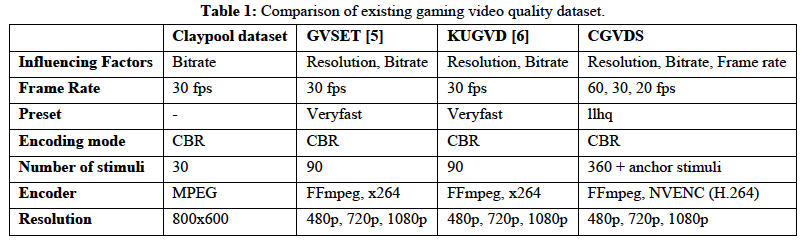

# Cloud-Gaming-Video-Dataset
 
### Introduction

For delay sensitive cloud gaming service, currently, most of the providers (e.g. Geforce Now and Parsec) use the hardware accelerated implementation of H.264/MPEG-AVC standard. CGVDS is created using hardware accelerated implementation of H.264/MPEG-AVC (NVENC) with a wide spread of video games and encoding parameters and reference videos captured at 60 fps using Fraps. Table 1 gives a short overview of the three available gaming video quality datasets compared to the CGVDS dataset. 

 

In series of subjective tests with over 100 participants, the influence of three important encoding parameters using 15 different games on the perceived video quality was assessed. The subjective tests were conducted as a passive viewing-and-listening test as described in ITU-T Rec. P.809 [15]. In order to avoid fatigue due to lengthy subjective tests, five studies were designed, each with 3 games and four different bitrate levels and two or three resolution and frame rate levels. Table 2 gives a summary of encoding parameters used to create the encoded videos and details on bitrate per framerate and resolution is given in Table 3. 

 

 

### Access to the dataset

All the dataset material can be found in the following link: 
Link: TBA

The dataset has four folders as follows:

1.	Subject Ratings: subjective ratings together with additional pre/post-game ratings. Raw subjective rating will be realized upon acceptance of the paper. 

2.	MOS information: The Mean Opinion Score (MOS) information is provided together with some plots lined to MOS ratings. Below you can find the abbreviations of scales in the shared excel file. 
   - Video Quality in 7-point continues scale (VQ_EC), Video Fragmentation in 7-point continues scale (VF_EC),	Video Unclearness in 7-point continues scale (VU_EC),	Video Discontinuety in 7-point continues scale (VD_EC),	Acceptance of condition in 7-point continues scale (after averaging binary individuale values and scaled it up) (AC_EC), 	Video Quality in 5-point continues scale (VQ_ACR),	Video Fragmentation in 7-point continues scale (VF_ACR),	Video Unclearness in 7-point continues scale (VU_ACR),	Video Discontinuety in 7-point continues scale (VD_ACR),	Acceptance of condition in 7-point continues scale (after averaging binary individuale values and scaled it up) (AC_ACR)

3.	Plots and Metrics: the results of objective metrics are provided in frame level as well video level together with some scatter plots of each metric and subjective results. The plot and frame-level information of metrics will be uploaded in few days. 

4.	Materials: the raw reference sequence in YUV format together with encoded videos in mp4 format at spatial resolutions are provided in this folder.

In order to encode the video we used the following command on ffmpeg:

ffmpeg -y -r ${framerate} -s:v 1920x1080 -i ${file} -r ${framerate} -c:v h264_nvenc -rc cbr_ld_hq -preset llhq -zerolatency 1 -forced-idr 1 -pixel_format yuv420p -b:v $bitrate$'k' -minrate $bitrate$'k' -maxrate $bitrate$'k' -bufsize $bitrate$'k' ${file%.*}_${encodingresolution}_${framerate}_${bitrate}_${codec}.mp4

In order to rescale the videos to 1080p we used bilinear method as follows:

ffmpeg -y -i ${file%.*}.mp4 -filter:v scale=1920:1080 -sws_flags "bilinear" -vcodec rawvideo -pix_fmt yuv420p -f rawvideo PATH/${file%.*}.yuv

### Copyrights 

It has to be noted the copyrights of the shared videos follow the same right that are defined by owners. We summarize them in the link below:
https://drive.google.com/file/d/17dqofyMjlbqPcoS7O1a55ySdiPWjRx01/view?usp=sharing
All videos that are shared to public are allowed to be shared for non-commercial usage based on our understanding of the copyright notice of publishers/oweners or based on the direct response from the oweners/publishers. It has to be noted that we try to keep checking the copyrights of the games every six months for 2 years and avoid any infringements of the intellectual property rights. 
